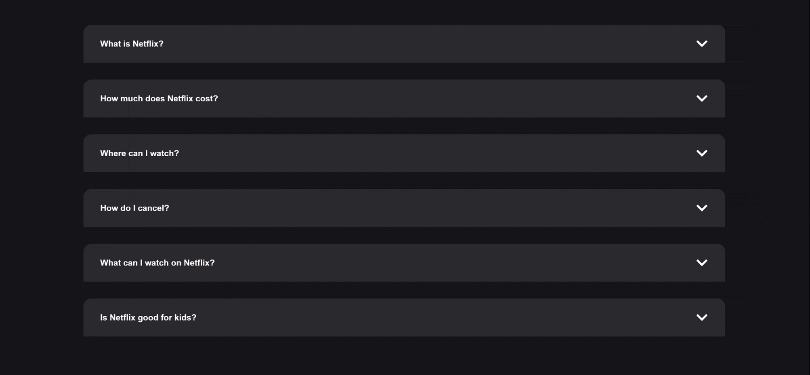

# Accordion Application

This is a simple React application that displays a list of Frequently Asked Questions (FAQs) in an accordion format.

## Project Structure

The project is divided into several React components and a CSS file for styling:

- `App.jsx`: This is the entry point of the application. It renders the Accordion component.

- `components/Accordion.jsx`: This component handles the state for the active accordion item and maps through the FAQs data to render each AccordionItem.

- `components/AccordionItem.jsx`: This component displays an individual FAQ item. It shows and hides the answer based on whether the item is the active one.

- `components/AccordionItem.css`: This file contains all the styles for the AccordionItem component.

- `data/faqs.js`: This file holds the FAQs data that the Accordion component uses to generate the AccordionItems.

## Installation

1. Clone the repository:
`git clone https://github.com/colinswan/accordion-react.git`

1. Install the dependencies:
cd accordion-react
`npm install`

1. Start the application:
`npm start`

## Usage

Click on any question to expand the accordion item and reveal the answer. Clicking on the same question again will collapse the item.

## Contributing

Pull requests are welcome. For major changes, please open an issue first to discuss what you would like to change.

## Accordion Demo

